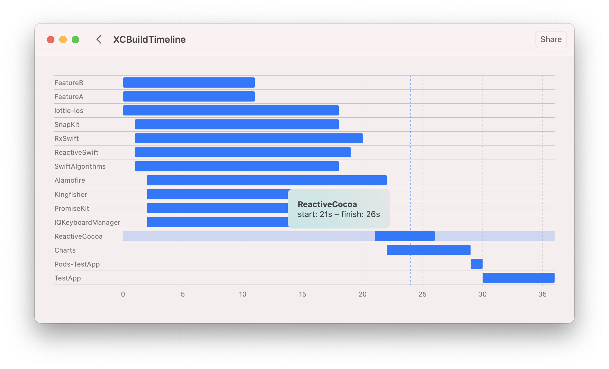

## XCBuildTimeline

XCBuildTimeline is an open-source application for measuring the compilation time of projects based on xcodeproj files.

## Usage
1. Open XCBuildTimeline
2. Drop your root project directory or select. (e.g., ./TestApp/ from the current repository)
3. Click to Install scripts (This action injects time logging scripts to all founded projects. This script record timestamps of start and finish build schemes)
4. Select Workspace and Scheme.
5. Build an application (This action executes: "xcodebuild clean build with your settings") or build your project by Xcode.
6. Drop timeline_*.json file from the root project directory to XCBuildTimeline.
7. Select Show charts

## Installation
You need to clone the repo and run the project. 

## License
XCBuildTimeline is available under the MIT license. See the LICENSE file for more info.
